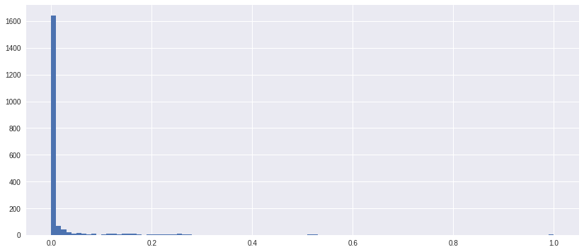
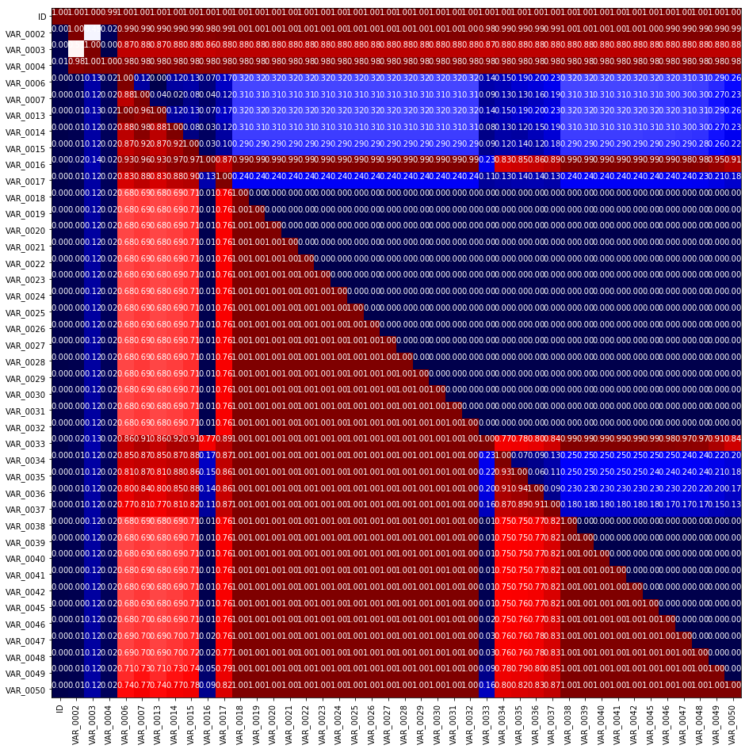
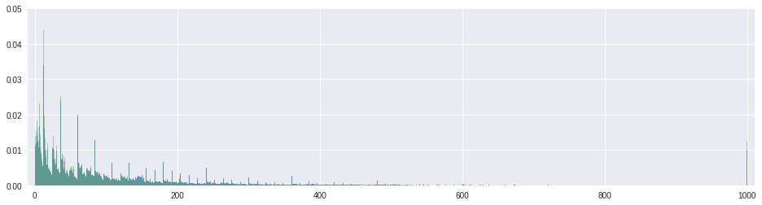
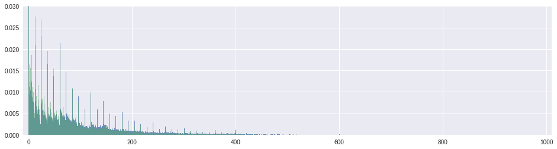
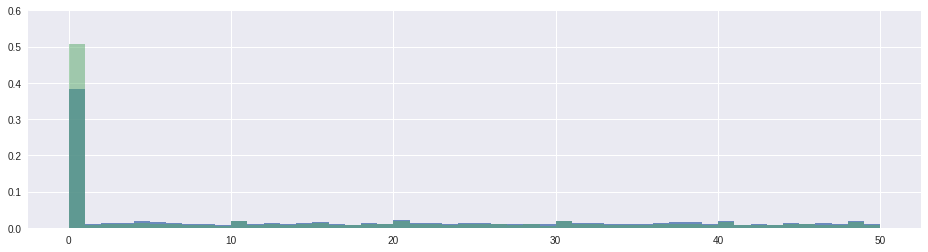
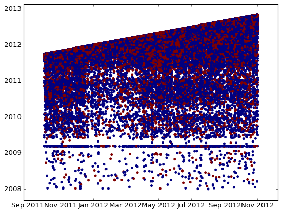

This is a notebook, used in the screencast video. Note, that the data files are not present here in Jupyter hub and you will not be able to run it. But you can always download the notebook to your local machine as well as the competition data and make it interactive. Competition data can be found here: https://www.kaggle.com/c/springleaf-marketing-response/data


```python
import os
import numpy as np
import pandas as pd 
from tqdm import tqdm_notebook
import matplotlib.pyplot as plt
%matplotlib inline

import warnings
warnings.filterwarnings('ignore')

import seaborn
```


```python
def autolabel(arrayA):
    ''' label each colored square with the corresponding data value. 
    If value > 20, the text is in black, else in white.
    '''
    arrayA = np.array(arrayA)
    for i in range(arrayA.shape[0]):
        for j in range(arrayA.shape[1]):
                plt.text(j,i, "%.2f"%arrayA[i,j], ha='center', va='bottom',color='w')

def hist_it(feat):
    plt.figure(figsize=(16,4))
    feat[Y==0].hist(bins=range(int(feat.min()),int(feat.max()+2)),normed=True,alpha=0.8)
    feat[Y==1].hist(bins=range(int(feat.min()),int(feat.max()+2)),normed=True,alpha=0.5)
    plt.ylim((0,1))
    
def gt_matrix(feats,sz=16):
    a = []
    for i,c1 in enumerate(feats):
        b = [] 
        for j,c2 in enumerate(feats):
            mask = (~train[c1].isnull()) & (~train[c2].isnull())
            if i>=j:
                b.append((train.loc[mask,c1].values>=train.loc[mask,c2].values).mean())
            else:
                b.append((train.loc[mask,c1].values>train.loc[mask,c2].values).mean())

        a.append(b)

    plt.figure(figsize = (sz,sz))
    plt.imshow(a, interpolation = 'None')
    _ = plt.xticks(range(len(feats)),feats,rotation = 90)
    _ = plt.yticks(range(len(feats)),feats,rotation = 0)
    autolabel(a)
```


```python
def hist_it1(feat):
    plt.figure(figsize=(16,4))
    feat[Y==0].hist(bins=100,range=(feat.min(),feat.max()),normed=True,alpha=0.5)
    feat[Y==1].hist(bins=100,range=(feat.min(),feat.max()),normed=True,alpha=0.5)
    plt.ylim((0,1))
```

# Read the data


```python
train = pd.read_csv('train.csv.zip')
Y = train.target
```


```python
test = pd.read_csv('test.csv.zip')
test_ID = test.ID
```

# Data overview

Probably the first thing you check is the shapes of the train and test matrices and look inside them.


```python
print 'Train shape', train.shape
print 'Test shape',  test.shape
```

    Train shape (145231, 1934)
    Test shape (145232, 1933)


```python
train.head()
```


<div>
<style>
    .dataframe thead tr:only-child th {
        text-align: right;
    }

    .dataframe thead th {
        text-align: left;
    }

    .dataframe tbody tr th {
        vertical-align: top;
    }
</style>
<table border="1" class="dataframe">
  <thead>
    <tr style="text-align: right;">
      <th></th>
      <th>ID</th>
      <th>VAR_0001</th>
      <th>VAR_0002</th>
      <th>VAR_0003</th>
      <th>VAR_0004</th>
      <th>VAR_0005</th>
      <th>VAR_0006</th>
      <th>VAR_0007</th>
      <th>VAR_0008</th>
      <th>VAR_0009</th>
      <th>...</th>
      <th>VAR_1926</th>
      <th>VAR_1927</th>
      <th>VAR_1928</th>
      <th>VAR_1929</th>
      <th>VAR_1930</th>
      <th>VAR_1931</th>
      <th>VAR_1932</th>
      <th>VAR_1933</th>
      <th>VAR_1934</th>
      <th>target</th>
    </tr>
  </thead>
  <tbody>
    <tr>
      <th>0</th>
      <td>2</td>
      <td>H</td>
      <td>224</td>
      <td>0</td>
      <td>4300</td>
      <td>C</td>
      <td>0.0</td>
      <td>0.0</td>
      <td>False</td>
      <td>False</td>
      <td>...</td>
      <td>98</td>
      <td>98</td>
      <td>998</td>
      <td>999999998</td>
      <td>998</td>
      <td>998</td>
      <td>9998</td>
      <td>9998</td>
      <td>IAPS</td>
      <td>0</td>
    </tr>
    <tr>
      <th>1</th>
      <td>4</td>
      <td>H</td>
      <td>7</td>
      <td>53</td>
      <td>4448</td>
      <td>B</td>
      <td>1.0</td>
      <td>0.0</td>
      <td>False</td>
      <td>False</td>
      <td>...</td>
      <td>98</td>
      <td>98</td>
      <td>998</td>
      <td>999999998</td>
      <td>998</td>
      <td>998</td>
      <td>9998</td>
      <td>9998</td>
      <td>IAPS</td>
      <td>0</td>
    </tr>
    <tr>
      <th>2</th>
      <td>5</td>
      <td>H</td>
      <td>116</td>
      <td>3</td>
      <td>3464</td>
      <td>C</td>
      <td>0.0</td>
      <td>0.0</td>
      <td>False</td>
      <td>False</td>
      <td>...</td>
      <td>98</td>
      <td>98</td>
      <td>998</td>
      <td>999999998</td>
      <td>998</td>
      <td>998</td>
      <td>9998</td>
      <td>9998</td>
      <td>IAPS</td>
      <td>0</td>
    </tr>
    <tr>
      <th>3</th>
      <td>7</td>
      <td>H</td>
      <td>240</td>
      <td>300</td>
      <td>3200</td>
      <td>C</td>
      <td>0.0</td>
      <td>0.0</td>
      <td>False</td>
      <td>False</td>
      <td>...</td>
      <td>98</td>
      <td>98</td>
      <td>998</td>
      <td>999999998</td>
      <td>998</td>
      <td>998</td>
      <td>9998</td>
      <td>9998</td>
      <td>RCC</td>
      <td>0</td>
    </tr>
    <tr>
      <th>4</th>
      <td>8</td>
      <td>R</td>
      <td>72</td>
      <td>261</td>
      <td>2000</td>
      <td>N</td>
      <td>0.0</td>
      <td>0.0</td>
      <td>False</td>
      <td>False</td>
      <td>...</td>
      <td>98</td>
      <td>98</td>
      <td>998</td>
      <td>999999998</td>
      <td>998</td>
      <td>998</td>
      <td>9998</td>
      <td>9998</td>
      <td>BRANCH</td>
      <td>1</td>
    </tr>
  </tbody>
</table>
<p>5 rows × 1934 columns</p>
</div>


```python
test.head()
```


<div>
<style>
    .dataframe thead tr:only-child th {
        text-align: right;
    }

    .dataframe thead th {
        text-align: left;
    }

    .dataframe tbody tr th {
        vertical-align: top;
    }
</style>
<table border="1" class="dataframe">
  <thead>
    <tr style="text-align: right;">
      <th></th>
      <th>ID</th>
      <th>VAR_0001</th>
      <th>VAR_0002</th>
      <th>VAR_0003</th>
      <th>VAR_0004</th>
      <th>VAR_0005</th>
      <th>VAR_0006</th>
      <th>VAR_0007</th>
      <th>VAR_0008</th>
      <th>VAR_0009</th>
      <th>...</th>
      <th>VAR_1925</th>
      <th>VAR_1926</th>
      <th>VAR_1927</th>
      <th>VAR_1928</th>
      <th>VAR_1929</th>
      <th>VAR_1930</th>
      <th>VAR_1931</th>
      <th>VAR_1932</th>
      <th>VAR_1933</th>
      <th>VAR_1934</th>
    </tr>
  </thead>
  <tbody>
    <tr>
      <th>0</th>
      <td>1</td>
      <td>R</td>
      <td>360</td>
      <td>25</td>
      <td>2251</td>
      <td>B</td>
      <td>2.0</td>
      <td>2.0</td>
      <td>False</td>
      <td>False</td>
      <td>...</td>
      <td>0</td>
      <td>98</td>
      <td>98</td>
      <td>998</td>
      <td>999999998</td>
      <td>998</td>
      <td>998</td>
      <td>9998</td>
      <td>9998</td>
      <td>IAPS</td>
    </tr>
    <tr>
      <th>1</th>
      <td>3</td>
      <td>R</td>
      <td>74</td>
      <td>192</td>
      <td>3274</td>
      <td>C</td>
      <td>2.0</td>
      <td>3.0</td>
      <td>False</td>
      <td>False</td>
      <td>...</td>
      <td>0</td>
      <td>98</td>
      <td>98</td>
      <td>998</td>
      <td>999999998</td>
      <td>998</td>
      <td>998</td>
      <td>9998</td>
      <td>9998</td>
      <td>IAPS</td>
    </tr>
    <tr>
      <th>2</th>
      <td>6</td>
      <td>R</td>
      <td>21</td>
      <td>36</td>
      <td>3500</td>
      <td>C</td>
      <td>1.0</td>
      <td>1.0</td>
      <td>False</td>
      <td>False</td>
      <td>...</td>
      <td>0</td>
      <td>98</td>
      <td>98</td>
      <td>998</td>
      <td>999999998</td>
      <td>998</td>
      <td>998</td>
      <td>9998</td>
      <td>9998</td>
      <td>IAPS</td>
    </tr>
    <tr>
      <th>3</th>
      <td>9</td>
      <td>R</td>
      <td>8</td>
      <td>2</td>
      <td>1500</td>
      <td>B</td>
      <td>0.0</td>
      <td>0.0</td>
      <td>False</td>
      <td>False</td>
      <td>...</td>
      <td>0</td>
      <td>98</td>
      <td>98</td>
      <td>998</td>
      <td>999999998</td>
      <td>998</td>
      <td>998</td>
      <td>9998</td>
      <td>9998</td>
      <td>IAPS</td>
    </tr>
    <tr>
      <th>4</th>
      <td>10</td>
      <td>H</td>
      <td>91</td>
      <td>39</td>
      <td>84500</td>
      <td>C</td>
      <td>8.0</td>
      <td>3.0</td>
      <td>False</td>
      <td>False</td>
      <td>...</td>
      <td>0</td>
      <td>98</td>
      <td>98</td>
      <td>998</td>
      <td>999999998</td>
      <td>998</td>
      <td>998</td>
      <td>9998</td>
      <td>9998</td>
      <td>IAPS</td>
    </tr>
  </tbody>
</table>
<p>5 rows × 1933 columns</p>
</div>


There are almost 2000 anonymized variables! It's clear, some of them are categorical, some look like numeric. Some numeric feateures are integer typed, so probably they are event conters or dates. And others are of float type, but from the first few rows they look like integer-typed too, since fractional part is zero, but pandas treats them as `float` since there are NaN values in that features.   

From the first glance we see train has one more column `target` which we should not forget to drop before fitting a classifier. We also see `ID` column is shared between train and test, which sometimes can be succesfully used to improve the score.

It is also useful to know if there are any NaNs in the data. You should pay attention to columns with NaNs and the number of NaNs for each row can serve as a nice feature later.


```python
# Number of NaNs for each object
train.isnull().sum(axis=1).head(15)
```


    0     25
    1     19
    2     24
    3     24
    4     24
    5     24
    6     24
    7     24
    8     16
    9     24
    10    22
    11    24
    12    17
    13    24
    14    24
    dtype: int64


```python
# Number of NaNs for each column
train.isnull().sum(axis=0).head(15)
```


    ID           0
    VAR_0001     0
    VAR_0002     0
    VAR_0003     0
    VAR_0004     0
    VAR_0005     0
    VAR_0006    56
    VAR_0007    56
    VAR_0008    56
    VAR_0009    56
    VAR_0010    56
    VAR_0011    56
    VAR_0012    56
    VAR_0013    56
    VAR_0014    56
    dtype: int64


Just by reviewing the head of the lists we immediately see the patterns, exactly 56 NaNs for a set of variables, and 24 NaNs for objects. 

# Dataset cleaning

### Remove constant features

All 1932 columns are anonimized which makes us to deduce the meaning of the features ourselves. We will now try to clean the dataset. 

It is usually convenient to concatenate train and test into one dataframe and do all feature engineering using it.


```python
traintest = pd.concat([train, test], axis = 0)
```

First we schould look for a constant features, such features do not provide any information and only make our dataset larger. 


```python
# `dropna = False` makes nunique treat NaNs as a distinct value
feats_counts = train.nunique(dropna = False)
```


```python
feats_counts.sort_values()[:10]
```


    VAR_0213    1
    VAR_0207    1
    VAR_0840    1
    VAR_0847    1
    VAR_1428    1
    VAR_1165    2
    VAR_0438    2
    VAR_1164    2
    VAR_1163    2
    VAR_1162    2
    dtype: int64


We found 5 constant features. Let's remove them.


```python
constant_features = feats_counts.loc[feats_counts==1].index.tolist()
print (constant_features)


traintest.drop(constant_features,axis = 1,inplace=True)
```

    ['VAR_0207', 'VAR_0213', 'VAR_0840', 'VAR_0847', 'VAR_1428']


### Remove duplicated features

Fill NaNs with something we can find later if needed.


```python
traintest.fillna('NaN', inplace=True)
```

Now let's encode each feature, as we discussed. 


```python
train_enc =  pd.DataFrame(index = train.index)

for col in tqdm_notebook(traintest.columns):
    train_enc[col] = train[col].factorize()[0]
```


    


We could also do something like this:


```python
# train_enc[col] = train[col].map(train[col].value_counts())
```

The resulting data frame is very very large, so we cannot just transpose it and use .duplicated. That is why we will use a simple loop.


```python
dup_cols = {}

for i, c1 in enumerate(tqdm_notebook(train_enc.columns)):
    for c2 in train_enc.columns[i + 1:]:
        if c2 not in dup_cols and np.all(train_enc[c1] == train_enc[c2]):
            dup_cols[c2] = c1
```


    


```python
dup_cols
```


    {'VAR_0009': 'VAR_0008',
     'VAR_0010': 'VAR_0008',
     'VAR_0011': 'VAR_0008',
     'VAR_0012': 'VAR_0008',
     'VAR_0013': 'VAR_0006',
     'VAR_0018': 'VAR_0008',
     'VAR_0019': 'VAR_0008',
     'VAR_0020': 'VAR_0008',
     'VAR_0021': 'VAR_0008',
     'VAR_0022': 'VAR_0008',
     'VAR_0023': 'VAR_0008',
     'VAR_0024': 'VAR_0008',
     'VAR_0025': 'VAR_0008',
     'VAR_0026': 'VAR_0008',
     'VAR_0027': 'VAR_0008',
     'VAR_0028': 'VAR_0008',
     'VAR_0029': 'VAR_0008',
     'VAR_0030': 'VAR_0008',
     'VAR_0031': 'VAR_0008',
     'VAR_0032': 'VAR_0008',
     'VAR_0038': 'VAR_0008',
     'VAR_0039': 'VAR_0008',
     'VAR_0040': 'VAR_0008',
     'VAR_0041': 'VAR_0008',
     'VAR_0042': 'VAR_0008',
     'VAR_0043': 'VAR_0008',
     'VAR_0044': 'VAR_0008',
     'VAR_0181': 'VAR_0180',
     'VAR_0182': 'VAR_0180',
     'VAR_0189': 'VAR_0188',
     'VAR_0190': 'VAR_0188',
     'VAR_0196': 'VAR_0008',
     'VAR_0197': 'VAR_0008',
     'VAR_0199': 'VAR_0008',
     'VAR_0201': 'VAR_0051',
     'VAR_0202': 'VAR_0008',
     'VAR_0203': 'VAR_0008',
     'VAR_0210': 'VAR_0208',
     'VAR_0211': 'VAR_0208',
     'VAR_0215': 'VAR_0008',
     'VAR_0216': 'VAR_0008',
     'VAR_0221': 'VAR_0008',
     'VAR_0222': 'VAR_0008',
     'VAR_0223': 'VAR_0008',
     'VAR_0228': 'VAR_0227',
     'VAR_0229': 'VAR_0008',
     'VAR_0238': 'VAR_0089',
     'VAR_0239': 'VAR_0008',
     'VAR_0357': 'VAR_0260',
     'VAR_0394': 'VAR_0246',
     'VAR_0438': 'VAR_0246',
     'VAR_0446': 'VAR_0246',
     'VAR_0512': 'VAR_0506',
     'VAR_0527': 'VAR_0246',
     'VAR_0528': 'VAR_0246',
     'VAR_0529': 'VAR_0526',
     'VAR_0530': 'VAR_0246',
     'VAR_0672': 'VAR_0670',
     'VAR_1036': 'VAR_0916'}


Don't forget to save them, as it takes long time to find these.


```python
import cPickle as pickle
pickle.dump(dup_cols, open('dup_cols.p', 'w'), protocol=pickle.HIGHEST_PROTOCOL)
```

Drop from traintest.


```python
traintest.drop(dup_cols.keys(), axis = 1,inplace=True)
```

# Determine types

Let's examine the number of unique values.


```python
nunique = train.nunique(dropna=False)
nunique
```


    ID                145231
    VAR_0001               3
    VAR_0002             820
    VAR_0003             588
    VAR_0004            7935
    VAR_0005               4
    VAR_0006              38
    VAR_0007              36
    VAR_0008               2
    VAR_0009               2
    VAR_0010               2
    VAR_0011               2
    VAR_0012               2
    VAR_0013              38
    VAR_0014              38
    VAR_0015              27
    VAR_0016              30
    VAR_0017              26
    VAR_0018               2
    VAR_0019               2
    VAR_0020               2
    VAR_0021               2
    VAR_0022               2
    VAR_0023               2
    VAR_0024               2
    VAR_0025               2
    VAR_0026               2
    VAR_0027               2
    VAR_0028               2
    VAR_0029               2
                       ...  
    VAR_1907              41
    VAR_1908              37
    VAR_1909              41
    VAR_1910              37
    VAR_1911             107
    VAR_1912           16370
    VAR_1913           25426
    VAR_1914           14226
    VAR_1915            1148
    VAR_1916               8
    VAR_1917              10
    VAR_1918              86
    VAR_1919             383
    VAR_1920              22
    VAR_1921              18
    VAR_1922            6798
    VAR_1923            2445
    VAR_1924             573
    VAR_1925              11
    VAR_1926               6
    VAR_1927              10
    VAR_1928              30
    VAR_1929             591
    VAR_1930               8
    VAR_1931              10
    VAR_1932              74
    VAR_1933             363
    VAR_1934               5
    target                 2
    VAR_0004_mod50        50
    Length: 1935, dtype: int64


and build a histogram of those values


```python
plt.figure(figsize=(14,6))
_ = plt.hist(nunique.astype(float)/train.shape[0], bins=100)
```





Let's take a looks at the features with a huge number of unique values:


```python
mask = (nunique.astype(float)/train.shape[0] > 0.8)
train.loc[:, mask]
```


<div>
<style>
    .dataframe thead tr:only-child th {
        text-align: right;
    }

    .dataframe thead th {
        text-align: left;
    }

    .dataframe tbody tr th {
        vertical-align: top;
    }
</style>
<table border="1" class="dataframe">
  <thead>
    <tr style="text-align: right;">
      <th></th>
      <th>ID</th>
      <th>VAR_0212</th>
      <th>VAR_0227</th>
    </tr>
  </thead>
  <tbody>
    <tr>
      <th>0</th>
      <td>2</td>
      <td>NaN</td>
      <td>311951</td>
    </tr>
    <tr>
      <th>1</th>
      <td>4</td>
      <td>9.20713e+10</td>
      <td>2.76949e+06</td>
    </tr>
    <tr>
      <th>2</th>
      <td>5</td>
      <td>2.65477e+10</td>
      <td>654127</td>
    </tr>
    <tr>
      <th>3</th>
      <td>7</td>
      <td>7.75753e+10</td>
      <td>3.01509e+06</td>
    </tr>
    <tr>
      <th>4</th>
      <td>8</td>
      <td>6.04238e+10</td>
      <td>118678</td>
    </tr>
    <tr>
      <th>5</th>
      <td>14</td>
      <td>7.73796e+10</td>
      <td>1.76557e+06</td>
    </tr>
    <tr>
      <th>6</th>
      <td>16</td>
      <td>9.70303e+10</td>
      <td>80151</td>
    </tr>
    <tr>
      <th>7</th>
      <td>20</td>
      <td>3.10981e+10</td>
      <td>853641</td>
    </tr>
    <tr>
      <th>8</th>
      <td>21</td>
      <td>7.82124e+10</td>
      <td>1.40254e+06</td>
    </tr>
    <tr>
      <th>9</th>
      <td>22</td>
      <td>1.94014e+10</td>
      <td>2.2187e+06</td>
    </tr>
    <tr>
      <th>10</th>
      <td>23</td>
      <td>3.71295e+10</td>
      <td>2.77679e+06</td>
    </tr>
    <tr>
      <th>11</th>
      <td>24</td>
      <td>3.01203e+10</td>
      <td>434300</td>
    </tr>
    <tr>
      <th>12</th>
      <td>25</td>
      <td>1.80185e+10</td>
      <td>1.48914e+06</td>
    </tr>
    <tr>
      <th>13</th>
      <td>26</td>
      <td>9.83358e+10</td>
      <td>686666</td>
    </tr>
    <tr>
      <th>14</th>
      <td>28</td>
      <td>9.33087e+10</td>
      <td>1.4847e+06</td>
    </tr>
    <tr>
      <th>15</th>
      <td>30</td>
      <td>2.01715e+10</td>
      <td>883714</td>
    </tr>
    <tr>
      <th>16</th>
      <td>31</td>
      <td>4.15638e+10</td>
      <td>2.6707e+06</td>
    </tr>
    <tr>
      <th>17</th>
      <td>32</td>
      <td>9.17617e+10</td>
      <td>2.65485e+06</td>
    </tr>
    <tr>
      <th>18</th>
      <td>35</td>
      <td>3.81344e+10</td>
      <td>487721</td>
    </tr>
    <tr>
      <th>19</th>
      <td>36</td>
      <td>NaN</td>
      <td>2.54705e+06</td>
    </tr>
    <tr>
      <th>20</th>
      <td>37</td>
      <td>3.27144e+10</td>
      <td>1.74684e+06</td>
    </tr>
    <tr>
      <th>21</th>
      <td>38</td>
      <td>1.82142e+10</td>
      <td>2.5813e+06</td>
    </tr>
    <tr>
      <th>22</th>
      <td>40</td>
      <td>7.70153e+10</td>
      <td>2.59396e+06</td>
    </tr>
    <tr>
      <th>23</th>
      <td>42</td>
      <td>4.69701e+10</td>
      <td>1.02977e+06</td>
    </tr>
    <tr>
      <th>24</th>
      <td>43</td>
      <td>9.84442e+10</td>
      <td>1.45101e+06</td>
    </tr>
    <tr>
      <th>25</th>
      <td>46</td>
      <td>NaN</td>
      <td>2.37136e+06</td>
    </tr>
    <tr>
      <th>26</th>
      <td>50</td>
      <td>9.25094e+10</td>
      <td>665930</td>
    </tr>
    <tr>
      <th>27</th>
      <td>51</td>
      <td>3.09094e+10</td>
      <td>497686</td>
    </tr>
    <tr>
      <th>28</th>
      <td>52</td>
      <td>6.06105e+10</td>
      <td>1.95816e+06</td>
    </tr>
    <tr>
      <th>29</th>
      <td>54</td>
      <td>3.78768e+10</td>
      <td>1.62591e+06</td>
    </tr>
    <tr>
      <th>...</th>
      <td>...</td>
      <td>...</td>
      <td>...</td>
    </tr>
    <tr>
      <th>145201</th>
      <td>290409</td>
      <td>8.80126e+10</td>
      <td>1.83053e+06</td>
    </tr>
    <tr>
      <th>145202</th>
      <td>290412</td>
      <td>4.6152e+10</td>
      <td>1.02024e+06</td>
    </tr>
    <tr>
      <th>145203</th>
      <td>290414</td>
      <td>9.33055e+10</td>
      <td>1.88151e+06</td>
    </tr>
    <tr>
      <th>145204</th>
      <td>290415</td>
      <td>4.63509e+10</td>
      <td>669351</td>
    </tr>
    <tr>
      <th>145205</th>
      <td>290417</td>
      <td>2.36028e+10</td>
      <td>655797</td>
    </tr>
    <tr>
      <th>145206</th>
      <td>290424</td>
      <td>3.73293e+10</td>
      <td>1.45626e+06</td>
    </tr>
    <tr>
      <th>145207</th>
      <td>290426</td>
      <td>2.38892e+10</td>
      <td>1.9503e+06</td>
    </tr>
    <tr>
      <th>145208</th>
      <td>290427</td>
      <td>6.38632e+10</td>
      <td>596365</td>
    </tr>
    <tr>
      <th>145209</th>
      <td>290429</td>
      <td>3.00602e+10</td>
      <td>572119</td>
    </tr>
    <tr>
      <th>145210</th>
      <td>290431</td>
      <td>4.33429e+10</td>
      <td>16120</td>
    </tr>
    <tr>
      <th>145211</th>
      <td>290432</td>
      <td>3.86543e+10</td>
      <td>2.08375e+06</td>
    </tr>
    <tr>
      <th>145212</th>
      <td>290434</td>
      <td>9.21391e+10</td>
      <td>1.89779e+06</td>
    </tr>
    <tr>
      <th>145213</th>
      <td>290436</td>
      <td>3.07472e+10</td>
      <td>2.94532e+06</td>
    </tr>
    <tr>
      <th>145214</th>
      <td>290439</td>
      <td>7.83326e+10</td>
      <td>2.54726e+06</td>
    </tr>
    <tr>
      <th>145215</th>
      <td>290440</td>
      <td>NaN</td>
      <td>600318</td>
    </tr>
    <tr>
      <th>145216</th>
      <td>290441</td>
      <td>2.78561e+10</td>
      <td>602505</td>
    </tr>
    <tr>
      <th>145217</th>
      <td>290443</td>
      <td>1.90952e+10</td>
      <td>2.44184e+06</td>
    </tr>
    <tr>
      <th>145218</th>
      <td>290445</td>
      <td>4.62035e+10</td>
      <td>2.87349e+06</td>
    </tr>
    <tr>
      <th>145219</th>
      <td>290447</td>
      <td>NaN</td>
      <td>1.53493e+06</td>
    </tr>
    <tr>
      <th>145220</th>
      <td>290448</td>
      <td>7.54282e+10</td>
      <td>1.60102e+06</td>
    </tr>
    <tr>
      <th>145221</th>
      <td>290449</td>
      <td>4.30768e+10</td>
      <td>2.08415e+06</td>
    </tr>
    <tr>
      <th>145222</th>
      <td>290450</td>
      <td>7.81325e+10</td>
      <td>2.85367e+06</td>
    </tr>
    <tr>
      <th>145223</th>
      <td>290452</td>
      <td>4.51061e+10</td>
      <td>1.56506e+06</td>
    </tr>
    <tr>
      <th>145224</th>
      <td>290453</td>
      <td>4.62223e+10</td>
      <td>1.46815e+06</td>
    </tr>
    <tr>
      <th>145225</th>
      <td>290454</td>
      <td>7.74507e+10</td>
      <td>2.92811e+06</td>
    </tr>
    <tr>
      <th>145226</th>
      <td>290457</td>
      <td>7.05088e+10</td>
      <td>2.03657e+06</td>
    </tr>
    <tr>
      <th>145227</th>
      <td>290458</td>
      <td>9.02492e+10</td>
      <td>1.68013e+06</td>
    </tr>
    <tr>
      <th>145228</th>
      <td>290459</td>
      <td>9.17224e+10</td>
      <td>2.41922e+06</td>
    </tr>
    <tr>
      <th>145229</th>
      <td>290461</td>
      <td>4.51033e+10</td>
      <td>1.53960e+06</td>
    </tr>
    <tr>
      <th>145230</th>
      <td>290463</td>
      <td>9.14114e+10</td>
      <td>2.6609e+06</td>
    </tr>
  </tbody>
</table>
<p>145231 rows × 3 columns</p>
</div>


The values are not float, they are integer, so these features are likely to be even counts. Let's look at another pack of features.


```python
mask = (nunique.astype(float)/train.shape[0] < 0.8) & (nunique.astype(float)/train.shape[0] > 0.4)
train.loc[:25, mask]
```


<div>
<style>
    .dataframe thead tr:only-child th {
        text-align: right;
    }

    .dataframe thead th {
        text-align: left;
    }

    .dataframe tbody tr th {
        vertical-align: top;
    }
</style>
<table border="1" class="dataframe">
  <thead>
    <tr style="text-align: right;">
      <th></th>
      <th>VAR_0541</th>
      <th>VAR_0543</th>
      <th>VAR_0899</th>
      <th>VAR_1081</th>
      <th>VAR_1082</th>
      <th>VAR_1087</th>
      <th>VAR_1179</th>
      <th>VAR_1180</th>
      <th>VAR_1181</th>
    </tr>
  </thead>
  <tbody>
    <tr>
      <th>0</th>
      <td>49463</td>
      <td>116783</td>
      <td>112871</td>
      <td>76857</td>
      <td>76857</td>
      <td>116783</td>
      <td>76857</td>
      <td>76857</td>
      <td>76857</td>
    </tr>
    <tr>
      <th>1</th>
      <td>303472</td>
      <td>346196</td>
      <td>346375</td>
      <td>341365</td>
      <td>341365</td>
      <td>346196</td>
      <td>341365</td>
      <td>341365</td>
      <td>176604</td>
    </tr>
    <tr>
      <th>2</th>
      <td>94990</td>
      <td>122601</td>
      <td>121501</td>
      <td>107267</td>
      <td>107267</td>
      <td>121501</td>
      <td>107267</td>
      <td>107267</td>
      <td>58714</td>
    </tr>
    <tr>
      <th>3</th>
      <td>20593</td>
      <td>59490</td>
      <td>61890</td>
      <td>45794</td>
      <td>47568</td>
      <td>59490</td>
      <td>45794</td>
      <td>47568</td>
      <td>47568</td>
    </tr>
    <tr>
      <th>4</th>
      <td>10071</td>
      <td>35708</td>
      <td>34787</td>
      <td>20475</td>
      <td>23647</td>
      <td>34708</td>
      <td>20475</td>
      <td>23647</td>
      <td>23647</td>
    </tr>
    <tr>
      <th>5</th>
      <td>18877</td>
      <td>28055</td>
      <td>28455</td>
      <td>21139</td>
      <td>21139</td>
      <td>28055</td>
      <td>21139</td>
      <td>21139</td>
      <td>20627</td>
    </tr>
    <tr>
      <th>6</th>
      <td>321783</td>
      <td>333565</td>
      <td>886886</td>
      <td>327744</td>
      <td>327744</td>
      <td>333565</td>
      <td>327744</td>
      <td>327744</td>
      <td>163944</td>
    </tr>
    <tr>
      <th>7</th>
      <td>2961</td>
      <td>5181</td>
      <td>11084</td>
      <td>4326</td>
      <td>4326</td>
      <td>5181</td>
      <td>4326</td>
      <td>4326</td>
      <td>4326</td>
    </tr>
    <tr>
      <th>8</th>
      <td>20359</td>
      <td>30114</td>
      <td>33434</td>
      <td>24969</td>
      <td>27128</td>
      <td>30114</td>
      <td>24969</td>
      <td>27128</td>
      <td>27128</td>
    </tr>
    <tr>
      <th>9</th>
      <td>815</td>
      <td>1300</td>
      <td>7677</td>
      <td>1197</td>
      <td>1197</td>
      <td>1300</td>
      <td>1197</td>
      <td>1197</td>
      <td>1197</td>
    </tr>
    <tr>
      <th>10</th>
      <td>6088</td>
      <td>15233</td>
      <td>15483</td>
      <td>7077</td>
      <td>7077</td>
      <td>15233</td>
      <td>7077</td>
      <td>7077</td>
      <td>4033</td>
    </tr>
    <tr>
      <th>11</th>
      <td>432</td>
      <td>1457</td>
      <td>2000</td>
      <td>621</td>
      <td>621</td>
      <td>757</td>
      <td>621</td>
      <td>621</td>
      <td>621</td>
    </tr>
    <tr>
      <th>12</th>
      <td>383</td>
      <td>539</td>
      <td>860</td>
      <td>752</td>
      <td>1158</td>
      <td>539</td>
      <td>752</td>
      <td>1158</td>
      <td>1158</td>
    </tr>
    <tr>
      <th>13</th>
      <td>14359</td>
      <td>47562</td>
      <td>47562</td>
      <td>17706</td>
      <td>17706</td>
      <td>47562</td>
      <td>17706</td>
      <td>17706</td>
      <td>17706</td>
    </tr>
    <tr>
      <th>14</th>
      <td>145391</td>
      <td>218067</td>
      <td>214836</td>
      <td>176627</td>
      <td>176627</td>
      <td>216307</td>
      <td>175273</td>
      <td>175273</td>
      <td>91019</td>
    </tr>
    <tr>
      <th>15</th>
      <td>10040</td>
      <td>12119</td>
      <td>17263</td>
      <td>10399</td>
      <td>10399</td>
      <td>12119</td>
      <td>10399</td>
      <td>10399</td>
      <td>5379</td>
    </tr>
    <tr>
      <th>16</th>
      <td>4880</td>
      <td>9607</td>
      <td>9607</td>
      <td>9165</td>
      <td>9165</td>
      <td>9607</td>
      <td>9165</td>
      <td>9165</td>
      <td>9165</td>
    </tr>
    <tr>
      <th>17</th>
      <td>12900</td>
      <td>35590</td>
      <td>35781</td>
      <td>26096</td>
      <td>26096</td>
      <td>35590</td>
      <td>26096</td>
      <td>26096</td>
      <td>19646</td>
    </tr>
    <tr>
      <th>18</th>
      <td>104442</td>
      <td>139605</td>
      <td>150505</td>
      <td>136419</td>
      <td>142218</td>
      <td>139605</td>
      <td>136419</td>
      <td>142218</td>
      <td>142218</td>
    </tr>
    <tr>
      <th>19</th>
      <td>13898</td>
      <td>25566</td>
      <td>26685</td>
      <td>20122</td>
      <td>20122</td>
      <td>25566</td>
      <td>20122</td>
      <td>20122</td>
      <td>20122</td>
    </tr>
    <tr>
      <th>20</th>
      <td>3524</td>
      <td>10033</td>
      <td>10133</td>
      <td>5838</td>
      <td>5838</td>
      <td>10033</td>
      <td>5838</td>
      <td>5838</td>
      <td>5838</td>
    </tr>
    <tr>
      <th>21</th>
      <td>129873</td>
      <td>204072</td>
      <td>206946</td>
      <td>183049</td>
      <td>183049</td>
      <td>204072</td>
      <td>183049</td>
      <td>183049</td>
      <td>96736</td>
    </tr>
    <tr>
      <th>22</th>
      <td>3591</td>
      <td>11400</td>
      <td>17680</td>
      <td>5565</td>
      <td>5565</td>
      <td>11400</td>
      <td>5565</td>
      <td>5565</td>
      <td>5565</td>
    </tr>
    <tr>
      <th>23</th>
      <td>999999999</td>
      <td>999999999</td>
      <td>-99999</td>
      <td>999999999</td>
      <td>999999999</td>
      <td>999999999</td>
      <td>999999999</td>
      <td>999999999</td>
      <td>999999999</td>
    </tr>
    <tr>
      <th>24</th>
      <td>1270</td>
      <td>4955</td>
      <td>12201</td>
      <td>2490</td>
      <td>2490</td>
      <td>4955</td>
      <td>2490</td>
      <td>2490</td>
      <td>2490</td>
    </tr>
    <tr>
      <th>25</th>
      <td>2015</td>
      <td>2458</td>
      <td>2458</td>
      <td>2015</td>
      <td>2015</td>
      <td>2458</td>
      <td>2015</td>
      <td>2015</td>
      <td>1008</td>
    </tr>
  </tbody>
</table>
</div>


These look like counts too. First thing to notice is the 23th line: 99999.., -99999 values look like NaNs so we should probably built a related feature. Second: the columns are sometimes placed next to each other, so the columns are probably grouped together and we can disentangle that.      

Our conclusion: there are no floating point variables, there are some counts variables, which we will treat as numeric. 

And finally, let's pick one variable (in this case 'VAR_0015') from the third group of features.


```python
train['VAR_0015'].value_counts()
```


     0.0      102382
     1.0       28045
     2.0        8981
     3.0        3199
     4.0        1274
     5.0         588
     6.0         275
     7.0         166
     8.0          97
    -999.0        56
     9.0          51
     10.0         39
     11.0         18
     12.0         16
     13.0          9
     14.0          8
     15.0          8
     16.0          6
     22.0          3
     21.0          3
     19.0          1
     35.0          1
     17.0          1
     29.0          1
     18.0          1
     32.0          1
     23.0          1
    Name: VAR_0015, dtype: int64


```python
cat_cols = list(train.select_dtypes(include=['object']).columns)
num_cols = list(train.select_dtypes(exclude=['object']).columns)
```

# Go through

Let's replace NaNs with something first.


```python
train.replace('NaN', -999, inplace=True)
```

Let's calculate how many times one feature is greater than the other and create cross tabel out of it. 


```python
# select first 42 numeric features
feats = num_cols[:42]

# build 'mean(feat1 > feat2)' plot
gt_matrix(feats,16)
```





Indeed, we see interesting patterns here. There are blocks of geatures where one is strictly greater than the other. So we can hypothesize, that each column correspondes to cumulative counts, e.g. feature number one is counts in first month, second -- total count number in first two month and so on. So we immediately understand what features we should generate to make tree-based models more efficient: the differences between consecutive values.

## VAR_0002, VAR_0003 


```python
hist_it(train['VAR_0002'])
plt.ylim((0,0.05))
plt.xlim((-10,1010))

hist_it(train['VAR_0003'])
plt.ylim((0,0.03))
plt.xlim((-10,1010))
```


    (-10, 1010)








```python
train['VAR_0002'].value_counts()
```


    12     5264
    24     4763
    36     3499
    60     2899
    6      2657
    13     2478
    72     2243
    48     2222
    3      2171
    4      1917
    2      1835
    84     1801
    120    1786
    1      1724
    7      1671
    26     1637
    5      1624
    14     1572
    18     1555
    8      1513
    999    1510
    25     1504
    96     1445
    30     1438
    9      1306
    144    1283
    15     1221
    27     1186
    38     1146
    37     1078
           ... 
    877       1
    785       1
    750       1
    653       1
    784       1
    764       1
    751       1
    797       1
    926       1
    691       1
    808       1
    774       1
    902       1
    755       1
    656       1
    814       1
    813       1
    685       1
    739       1
    935       1
    906       1
    807       1
    550       1
    933       1
    804       1
    675       1
    674       1
    745       1
    778       1
    851       1
    Name: VAR_0002, Length: 820, dtype: int64


```python
train['VAR_0003'].value_counts()
```


    0      17436
    24      3469
    12      3271
    60      3054
    36      2498
    72      2081
    48      2048
    6       1993
    1       1797
    3       1679
    84      1553
    2       1459
    999     1428
    4       1419
    120     1411
    7       1356
    13      1297
    18      1296
    96      1253
    14      1228
    8       1216
    5       1189
    9       1182
    30      1100
    25      1100
    144     1090
    15      1047
    61      1008
    26       929
    42       921
           ...  
    560        1
    552        1
    550        1
    804        1
    543        1
    668        1
    794        1
    537        1
    531        1
    664        1
    632        1
    709        1
    597        1
    965        1
    852        1
    648        1
    596        1
    466        1
    592        1
    521        1
    533        1
    636        1
    975        1
    973        1
    587        1
    523        1
    584        1
    759        1
    583        1
    570        1
    Name: VAR_0003, Length: 588, dtype: int64


We see there is something special about 12, 24 and so on, sowe can create another feature x mod 12. 

## VAR_0004


```python
train['VAR_0004_mod50'] = train['VAR_0004'] % 50
hist_it(train['VAR_0004_mod50'])
plt.ylim((0,0.6))
```


    (0, 0.6)





# Categorical features

Let's take a look at categorical features we have.


```python
train.loc[:,cat_cols].head().T
```


<div>
<style>
    .dataframe thead tr:only-child th {
        text-align: right;
    }

    .dataframe thead th {
        text-align: left;
    }

    .dataframe tbody tr th {
        vertical-align: top;
    }
</style>
<table border="1" class="dataframe">
  <thead>
    <tr style="text-align: right;">
      <th></th>
      <th>0</th>
      <th>1</th>
      <th>2</th>
      <th>3</th>
      <th>4</th>
    </tr>
  </thead>
  <tbody>
    <tr>
      <th>VAR_0001</th>
      <td>H</td>
      <td>H</td>
      <td>H</td>
      <td>H</td>
      <td>R</td>
    </tr>
    <tr>
      <th>VAR_0005</th>
      <td>C</td>
      <td>B</td>
      <td>C</td>
      <td>C</td>
      <td>N</td>
    </tr>
    <tr>
      <th>VAR_0008</th>
      <td>False</td>
      <td>False</td>
      <td>False</td>
      <td>False</td>
      <td>False</td>
    </tr>
    <tr>
      <th>VAR_0009</th>
      <td>False</td>
      <td>False</td>
      <td>False</td>
      <td>False</td>
      <td>False</td>
    </tr>
    <tr>
      <th>VAR_0010</th>
      <td>False</td>
      <td>False</td>
      <td>False</td>
      <td>False</td>
      <td>False</td>
    </tr>
    <tr>
      <th>VAR_0011</th>
      <td>False</td>
      <td>False</td>
      <td>False</td>
      <td>False</td>
      <td>False</td>
    </tr>
    <tr>
      <th>VAR_0012</th>
      <td>False</td>
      <td>False</td>
      <td>False</td>
      <td>False</td>
      <td>False</td>
    </tr>
    <tr>
      <th>VAR_0043</th>
      <td>False</td>
      <td>False</td>
      <td>False</td>
      <td>False</td>
      <td>False</td>
    </tr>
    <tr>
      <th>VAR_0044</th>
      <td>[]</td>
      <td>[]</td>
      <td>[]</td>
      <td>[]</td>
      <td>[]</td>
    </tr>
    <tr>
      <th>VAR_0073</th>
      <td>NaT</td>
      <td>2012-09-04 00:00:00</td>
      <td>NaT</td>
      <td>NaT</td>
      <td>NaT</td>
    </tr>
    <tr>
      <th>VAR_0075</th>
      <td>2011-11-08 00:00:00</td>
      <td>2011-11-10 00:00:00</td>
      <td>2011-12-13 00:00:00</td>
      <td>2010-09-23 00:00:00</td>
      <td>2011-10-15 00:00:00</td>
    </tr>
    <tr>
      <th>VAR_0156</th>
      <td>NaT</td>
      <td>NaT</td>
      <td>NaT</td>
      <td>NaT</td>
      <td>NaT</td>
    </tr>
    <tr>
      <th>VAR_0157</th>
      <td>NaT</td>
      <td>NaT</td>
      <td>NaT</td>
      <td>NaT</td>
      <td>NaT</td>
    </tr>
    <tr>
      <th>VAR_0158</th>
      <td>NaT</td>
      <td>NaT</td>
      <td>NaT</td>
      <td>NaT</td>
      <td>NaT</td>
    </tr>
    <tr>
      <th>VAR_0159</th>
      <td>NaT</td>
      <td>NaT</td>
      <td>NaT</td>
      <td>NaT</td>
      <td>NaT</td>
    </tr>
    <tr>
      <th>VAR_0166</th>
      <td>NaT</td>
      <td>NaT</td>
      <td>NaT</td>
      <td>NaT</td>
      <td>NaT</td>
    </tr>
    <tr>
      <th>VAR_0167</th>
      <td>NaT</td>
      <td>NaT</td>
      <td>NaT</td>
      <td>NaT</td>
      <td>NaT</td>
    </tr>
    <tr>
      <th>VAR_0168</th>
      <td>NaT</td>
      <td>NaT</td>
      <td>NaT</td>
      <td>NaT</td>
      <td>NaT</td>
    </tr>
    <tr>
      <th>VAR_0169</th>
      <td>NaT</td>
      <td>NaT</td>
      <td>NaT</td>
      <td>NaT</td>
      <td>NaT</td>
    </tr>
    <tr>
      <th>VAR_0176</th>
      <td>NaT</td>
      <td>NaT</td>
      <td>NaT</td>
      <td>NaT</td>
      <td>NaT</td>
    </tr>
    <tr>
      <th>VAR_0177</th>
      <td>NaT</td>
      <td>NaT</td>
      <td>NaT</td>
      <td>NaT</td>
      <td>NaT</td>
    </tr>
    <tr>
      <th>VAR_0178</th>
      <td>NaT</td>
      <td>NaT</td>
      <td>NaT</td>
      <td>NaT</td>
      <td>NaT</td>
    </tr>
    <tr>
      <th>VAR_0179</th>
      <td>NaT</td>
      <td>NaT</td>
      <td>NaT</td>
      <td>NaT</td>
      <td>NaT</td>
    </tr>
    <tr>
      <th>VAR_0196</th>
      <td>False</td>
      <td>False</td>
      <td>False</td>
      <td>False</td>
      <td>False</td>
    </tr>
    <tr>
      <th>VAR_0200</th>
      <td>FT LAUDERDALE</td>
      <td>SANTEE</td>
      <td>REEDSVILLE</td>
      <td>LIBERTY</td>
      <td>FRANKFORT</td>
    </tr>
    <tr>
      <th>VAR_0202</th>
      <td>BatchInquiry</td>
      <td>BatchInquiry</td>
      <td>BatchInquiry</td>
      <td>BatchInquiry</td>
      <td>BatchInquiry</td>
    </tr>
    <tr>
      <th>VAR_0204</th>
      <td>2014-01-29 21:16:00</td>
      <td>2014-02-01 00:11:00</td>
      <td>2014-01-30 15:11:00</td>
      <td>2014-02-01 00:07:00</td>
      <td>2014-01-29 19:31:00</td>
    </tr>
    <tr>
      <th>VAR_0214</th>
      <td>NaN</td>
      <td>NaN</td>
      <td>NaN</td>
      <td>NaN</td>
      <td>NaN</td>
    </tr>
    <tr>
      <th>VAR_0216</th>
      <td>DS</td>
      <td>DS</td>
      <td>DS</td>
      <td>DS</td>
      <td>DS</td>
    </tr>
    <tr>
      <th>VAR_0217</th>
      <td>2011-11-08 02:00:00</td>
      <td>2012-10-02 02:00:00</td>
      <td>2011-12-13 02:00:00</td>
      <td>2012-11-01 02:00:00</td>
      <td>2011-10-15 02:00:00</td>
    </tr>
    <tr>
      <th>VAR_0222</th>
      <td>C6</td>
      <td>C6</td>
      <td>C6</td>
      <td>C6</td>
      <td>C6</td>
    </tr>
    <tr>
      <th>VAR_0226</th>
      <td>False</td>
      <td>False</td>
      <td>False</td>
      <td>False</td>
      <td>False</td>
    </tr>
    <tr>
      <th>VAR_0229</th>
      <td>False</td>
      <td>False</td>
      <td>False</td>
      <td>False</td>
      <td>False</td>
    </tr>
    <tr>
      <th>VAR_0230</th>
      <td>False</td>
      <td>False</td>
      <td>False</td>
      <td>False</td>
      <td>False</td>
    </tr>
    <tr>
      <th>VAR_0232</th>
      <td>True</td>
      <td>False</td>
      <td>True</td>
      <td>False</td>
      <td>True</td>
    </tr>
    <tr>
      <th>VAR_0236</th>
      <td>True</td>
      <td>True</td>
      <td>True</td>
      <td>True</td>
      <td>True</td>
    </tr>
    <tr>
      <th>VAR_0237</th>
      <td>FL</td>
      <td>CA</td>
      <td>WV</td>
      <td>TX</td>
      <td>IL</td>
    </tr>
    <tr>
      <th>VAR_0239</th>
      <td>False</td>
      <td>False</td>
      <td>False</td>
      <td>False</td>
      <td>False</td>
    </tr>
    <tr>
      <th>VAR_0274</th>
      <td>FL</td>
      <td>MI</td>
      <td>WV</td>
      <td>TX</td>
      <td>IL</td>
    </tr>
    <tr>
      <th>VAR_0283</th>
      <td>S</td>
      <td>S</td>
      <td>S</td>
      <td>S</td>
      <td>S</td>
    </tr>
    <tr>
      <th>VAR_0305</th>
      <td>S</td>
      <td>S</td>
      <td>P</td>
      <td>P</td>
      <td>P</td>
    </tr>
    <tr>
      <th>VAR_0325</th>
      <td>-1</td>
      <td>H</td>
      <td>R</td>
      <td>H</td>
      <td>S</td>
    </tr>
    <tr>
      <th>VAR_0342</th>
      <td>CF</td>
      <td>EC</td>
      <td>UU</td>
      <td>-1</td>
      <td>-1</td>
    </tr>
    <tr>
      <th>VAR_0352</th>
      <td>O</td>
      <td>O</td>
      <td>R</td>
      <td>R</td>
      <td>R</td>
    </tr>
    <tr>
      <th>VAR_0353</th>
      <td>U</td>
      <td>R</td>
      <td>R</td>
      <td>R</td>
      <td>U</td>
    </tr>
    <tr>
      <th>VAR_0354</th>
      <td>O</td>
      <td>R</td>
      <td>-1</td>
      <td>-1</td>
      <td>O</td>
    </tr>
    <tr>
      <th>VAR_0404</th>
      <td>CHIEF EXECUTIVE OFFICER</td>
      <td>-1</td>
      <td>-1</td>
      <td>-1</td>
      <td>-1</td>
    </tr>
    <tr>
      <th>VAR_0466</th>
      <td>-1</td>
      <td>I</td>
      <td>-1</td>
      <td>-1</td>
      <td>-1</td>
    </tr>
    <tr>
      <th>VAR_0467</th>
      <td>-1</td>
      <td>Discharged</td>
      <td>-1</td>
      <td>-1</td>
      <td>-1</td>
    </tr>
    <tr>
      <th>VAR_0493</th>
      <td>COMMUNITY ASSOCIATION MANAGER</td>
      <td>-1</td>
      <td>-1</td>
      <td>-1</td>
      <td>-1</td>
    </tr>
    <tr>
      <th>VAR_1934</th>
      <td>IAPS</td>
      <td>IAPS</td>
      <td>IAPS</td>
      <td>RCC</td>
      <td>BRANCH</td>
    </tr>
  </tbody>
</table>
</div>


`VAR_0200`, `VAR_0237`, `VAR_0274` look like some georgraphical data thus one could generate geography related features, we will talk later in the course.

There are some features, that are hard to identify, but look, there a date columns `VAR_0073` -- `VAR_0179`, `VAR_0204`, `VAR_0217`. It is useful to plot one date against another to find relationships. 


```python
date_cols = [u'VAR_0073','VAR_0075',
             u'VAR_0156',u'VAR_0157',u'VAR_0158','VAR_0159',
             u'VAR_0166', u'VAR_0167',u'VAR_0168',u'VAR_0169',
             u'VAR_0176',u'VAR_0177',u'VAR_0178',u'VAR_0179',
             u'VAR_0204',
             u'VAR_0217']

for c in date_cols:
    train[c] = pd.to_datetime(train[c],format = '%d%b%y:%H:%M:%S')
    test[c] = pd.to_datetime(test[c],  format = '%d%b%y:%H:%M:%S')
```


```python
c1 = 'VAR_0217'
c2 = 'VAR_0073'

# mask = (~test[c1].isnull()) & (~test[c2].isnull())
# sc2(test.ix[mask,c1].values,test.ix[mask,c2].values,alpha=0.7,c = 'black')

mask = (~train[c1].isnull()) & (~train[c2].isnull())
sc2(train.loc[mask,c1].values,train.loc[mask,c2].values,c=train.loc[mask,'target'].values)
```





We see that one date is strictly greater than the other, so the difference between them can be a good feature. Also look at horizontal line there -- it also looks like NaN, so I would rather create a new binary feature which will serve as an idicator that our time feature is NaN.
