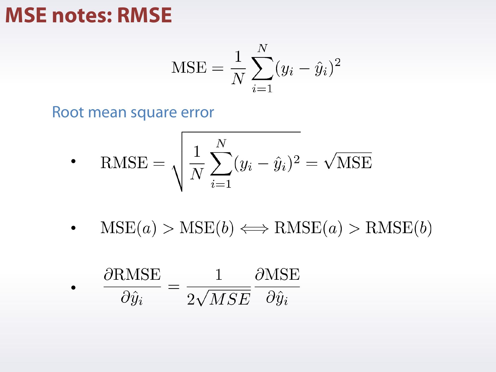
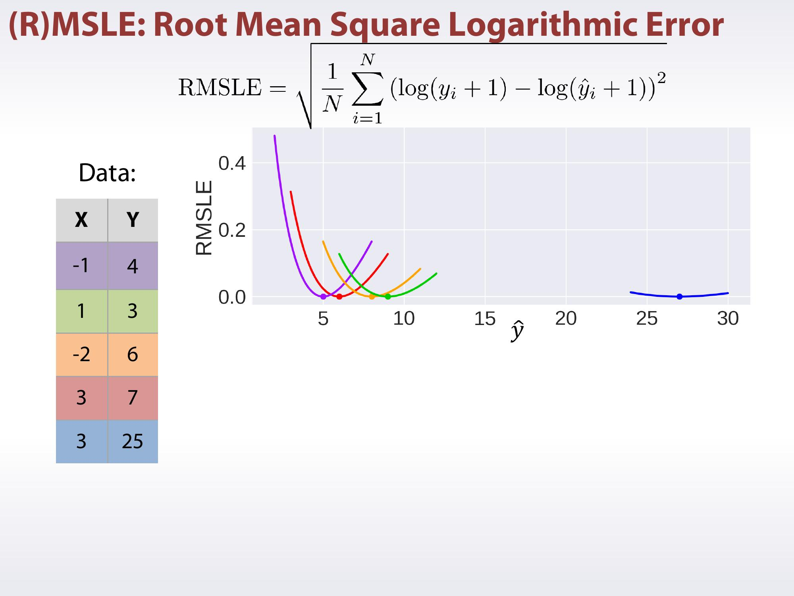
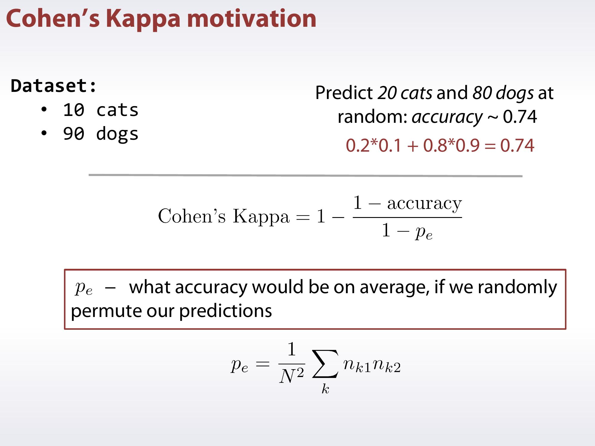
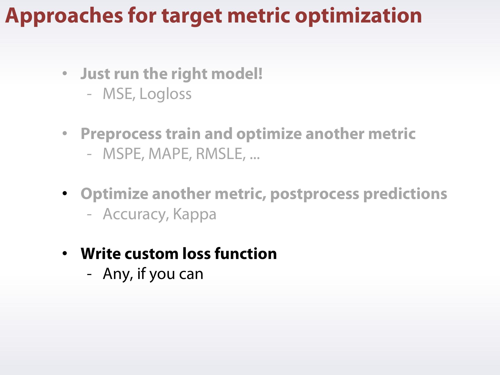
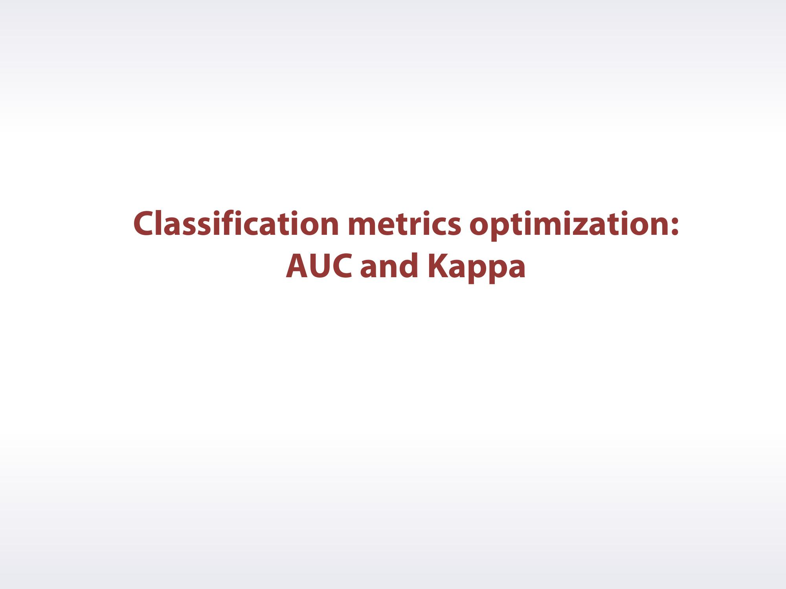

# Week 3
## Metrics optimization
### Motivation

### Regression metrics review 1

### Regression metrics review III

### Classification metrics review

### General approaches for metrics optimization

### Regression metrics optimization

### Classification metrics optimization I

### Classification metrics optimization II

