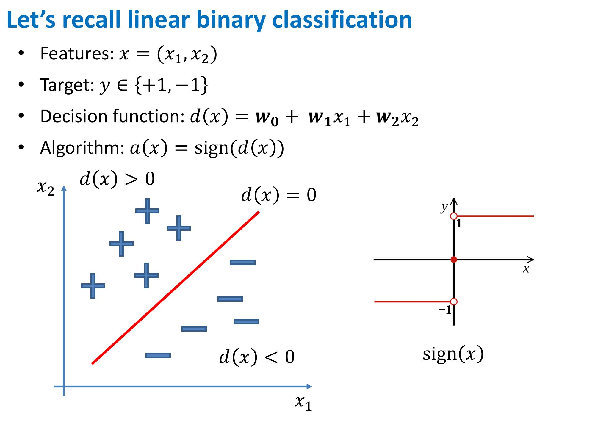
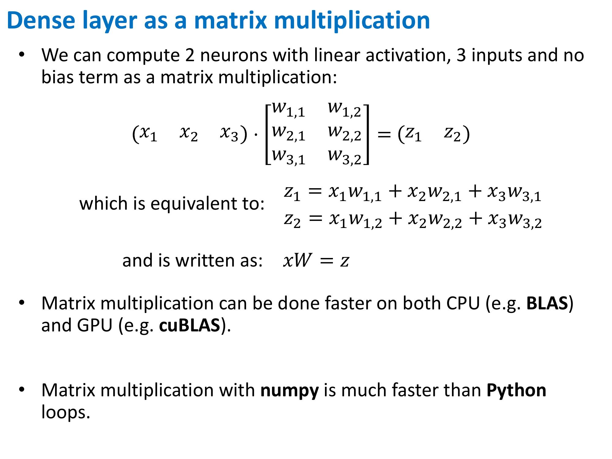

# Week2
## The simplest neural network: MLP
### Multilayer Perceptron

### Chain rule

### Backpropagation

## Matrix derivatives
### Efficient MLP implementation

## Other matrix derivatives

## Optional reading on matrix derivatives
* https://compsci697l.github.io/docs/vecDerivs.pdf
* https://www.math.uwaterloo.ca/~hwolkowi/matrixcookbook.pdf
