# Week3
## Introduction to CNN
### Motivation for convolutional layers


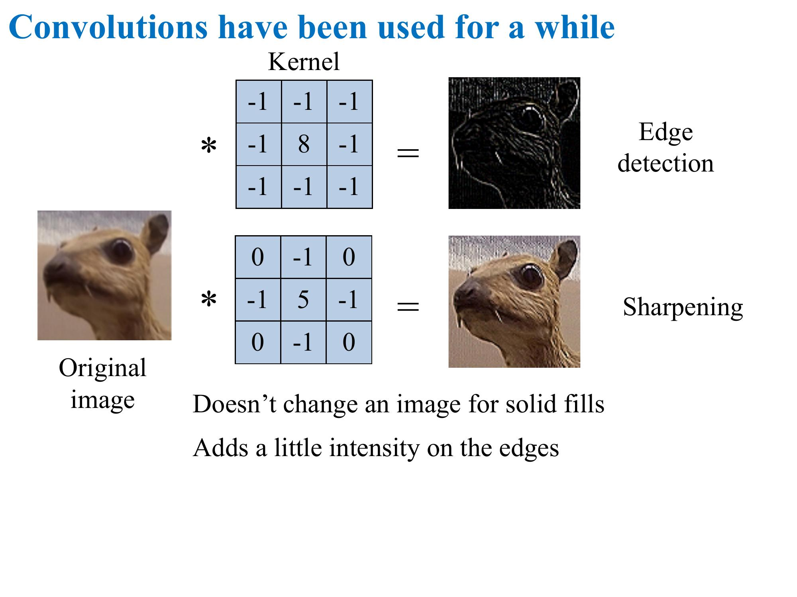


### Our first CNN Architecture


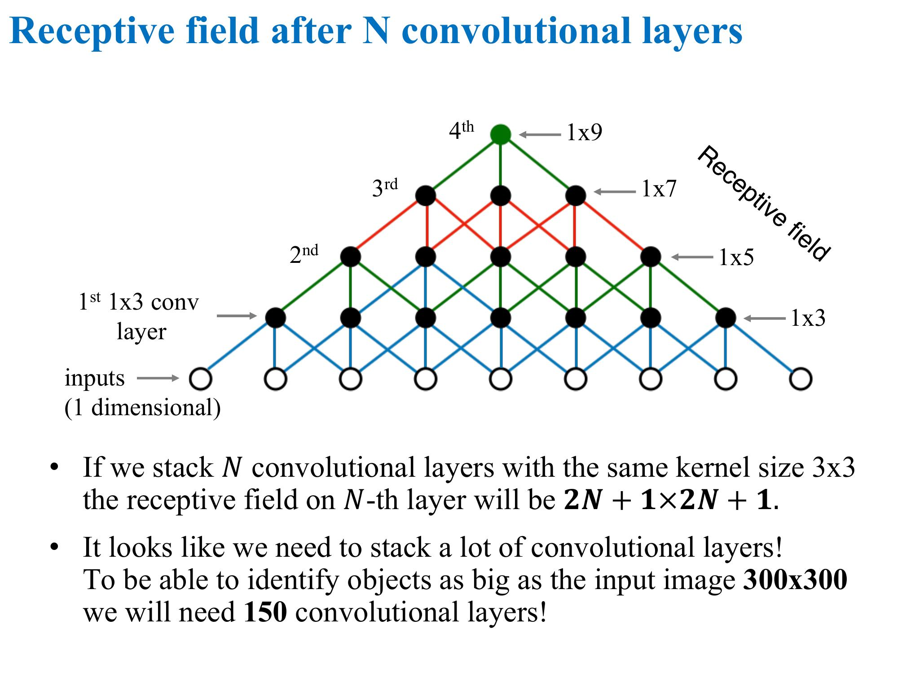


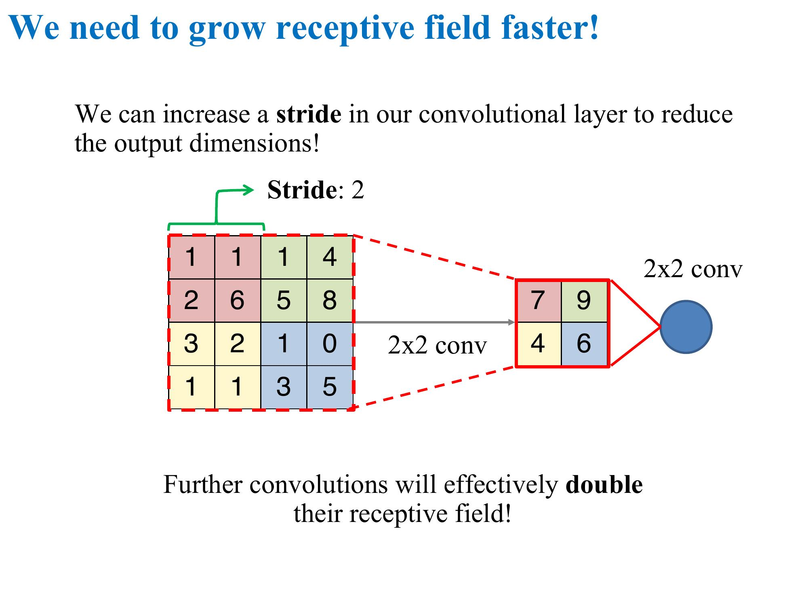


## Modern CNNs
### Training tips and tricks for deep CNNs


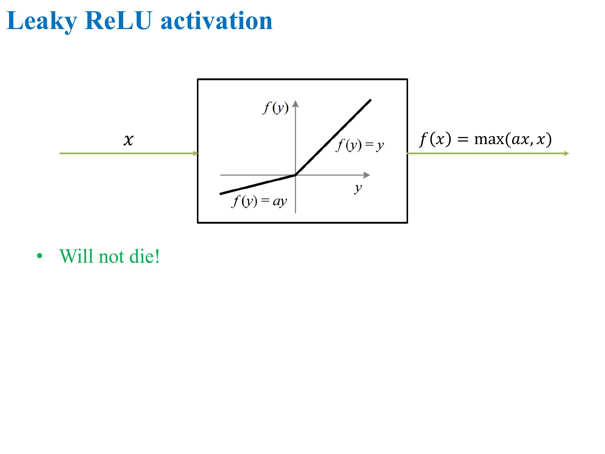


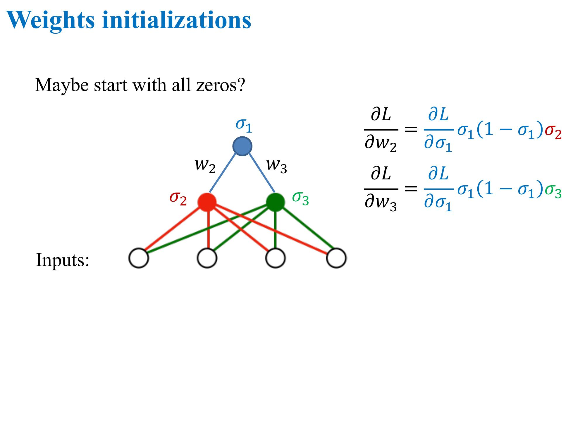


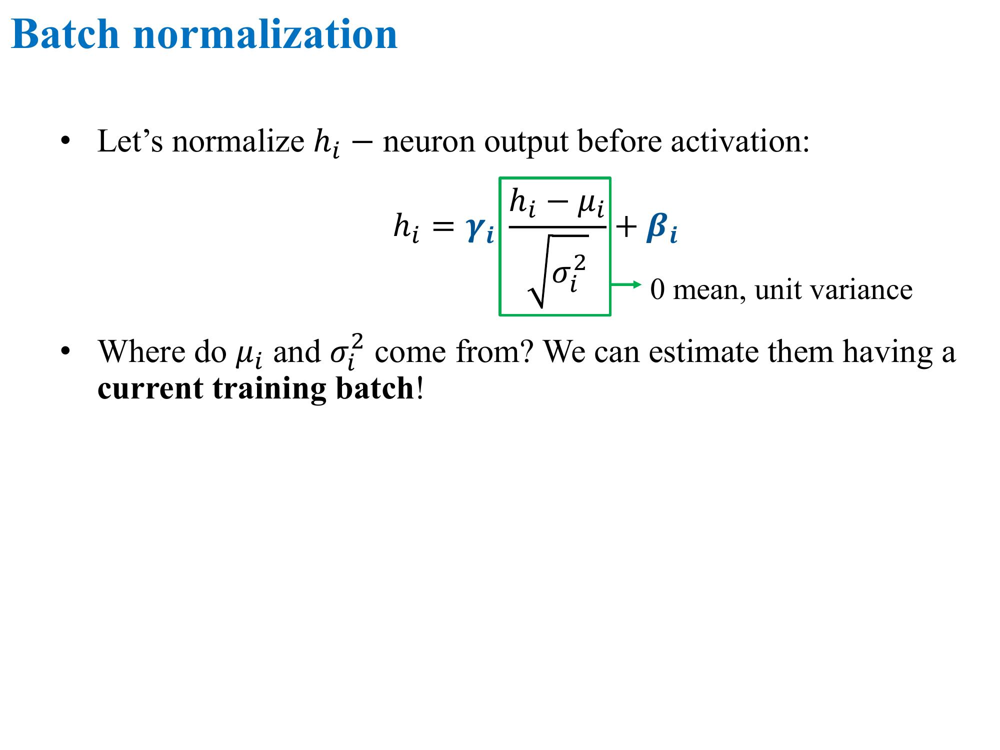


### Overview of modern CNN architectures


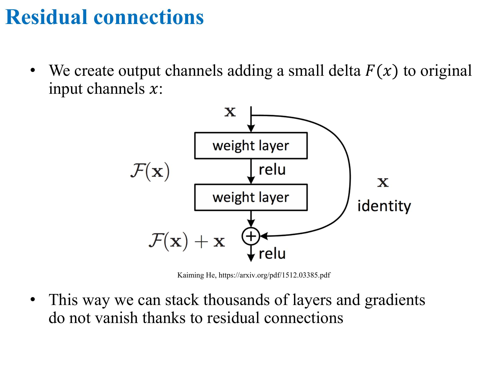


### Jupyter notebook - Offline Instructions
[Link](https://github.com/hse-aml/intro-to-dl/blob/master/README.md)

Coursera Jupyter Environment can be slow if many learners use it heavily. Our tasks are compute-heavy and we recommend to run them on your hardware for optimal performance.

You will need a computer with at least 4GB of RAM.

There're two options to setup the Jupyter Notebooks locally: Docker container and Anaconda.

#### Docker container option (best for Mac/Linux)
Follow the instructions on https://hub.docker.com/r/zimovnov/coursera-aml-docker/ to install Docker container with all necessary software installed.

After that you should see a Jupyter page in your browser.

#### Anaconda option (best for Windows)
We highly recommend to install docker environment, but if it's not an option, you can try to install the necessary python modules with Anaconda.

First, install Anaconda with Python 3.5+ from here.

Download conda_requirements.txt from here.

Open terminal on Mac/Linux or "Anaconda Prompt" in Start Menu on Windows and run:
```
conda config --append channels conda-forge
conda config --append channels menpo
conda install --yes --file conda_requirements.txt
```
To start Jupyter Notebooks run jupyter notebook on Mac/Linux or "Jupyter Notebook" in Start Menu on Windows.

After that you should see a Jupyter page in your browser.


#### Prepare resources inside Jupyter Notebooks (for local setups only)
Click New -> Terminal and execute: git clone https://github.com/hse-aml/intro-to-dl.git On Windows you might want to install Git. You can also download all the resources as zip archive from GitHub page.

Close the terminal and refresh Jupyter page, you will see intro-to-dl folder, go there, all the necessary notebooks are waiting for you.

First you need to download necessary resources, to do that open download_resources.ipynb and run cells for Keras and your week.

Now you can open a notebook for the corresponding week and work there just like in Coursera Jupyter Environment.

#### Using GPU for offline setup (for advanced users)
* If you have a Linux host you can try these instructions for Docker: https://github.com/ZEMUSHKA/coursera-aml-docker#using-gpu-in-your-container-linux-hosts-only
* The easiest way is to go with Anaconda setup, that doesn't need virtualization and thus works with a GPU on all platforms (including Windows and Mac). You will still have to install NVIDIA GPU driver, CUDA toolkit and CuDNN (requires registration with NVIDIA) on your host machine in order for TensorFlow to work with your GPU: https://www.tensorflow.org/versions/r1.2/install/install_linux#nvidia_requirements_to_run_tensorflow_with_gpu_support It can be hard to follow, so you might choose to stick to a CPU version, which is also fine for the purpose of this course.

#### Docker on linux 

Run 
```
docker pull zimovnov/coursera-aml-docker
docker run -itp 127.0.0.1:8080:8080 --name coursera-aml-1 zimovnov/coursera-aml-docker 
```
## Applications of CNNs
### Learning new tasks with pre-trained CNNs


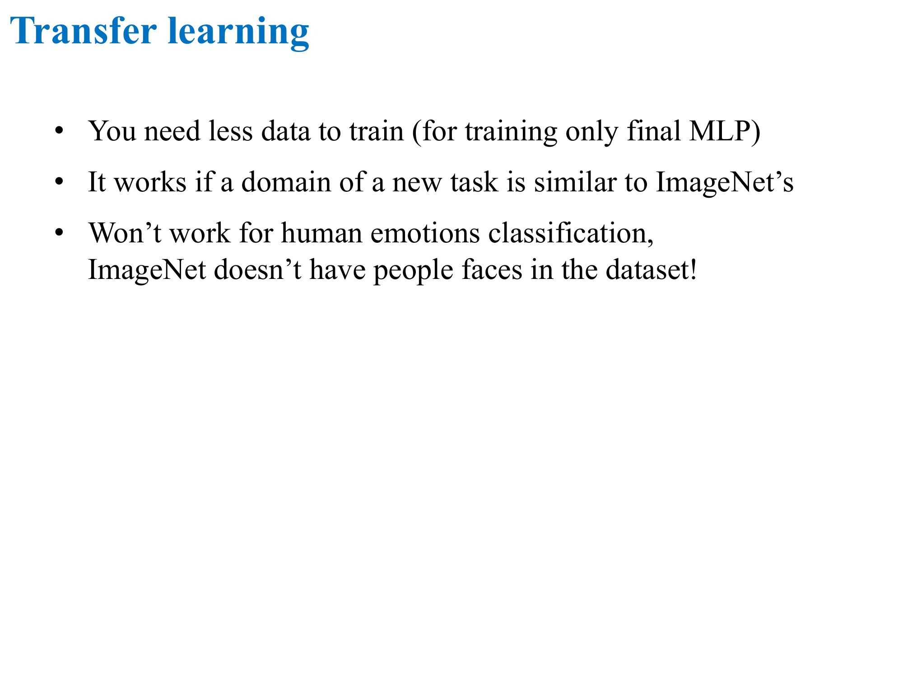


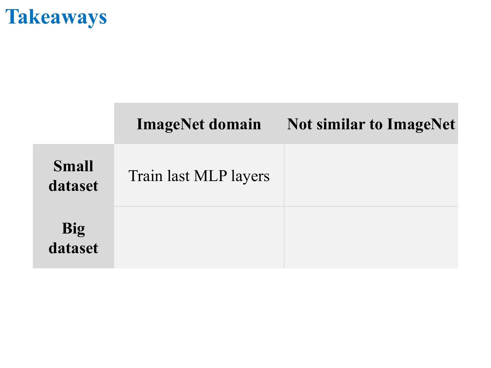


### A glimpse of other Computer Vision tasks

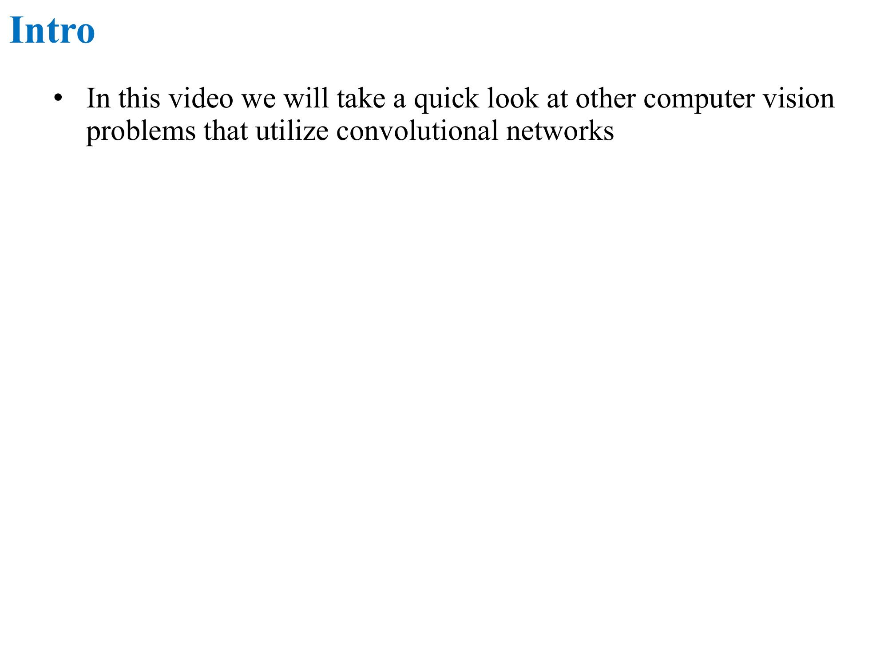


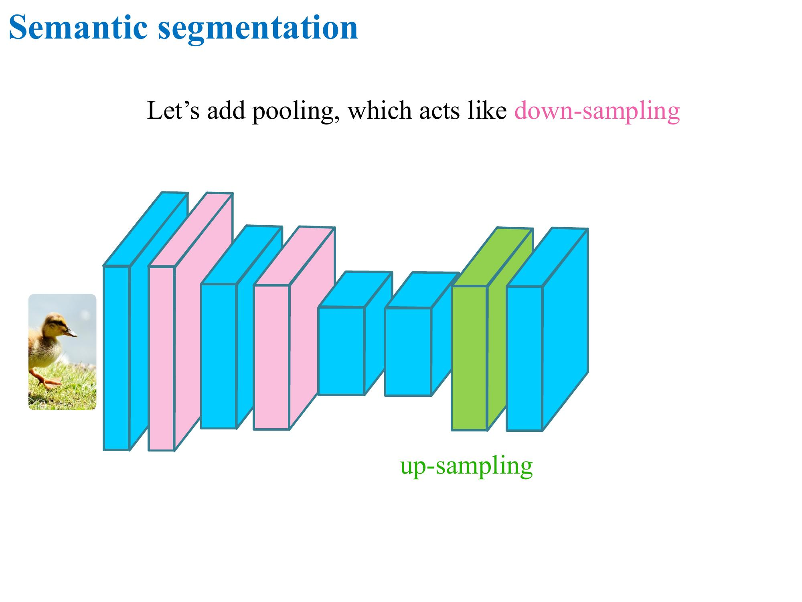


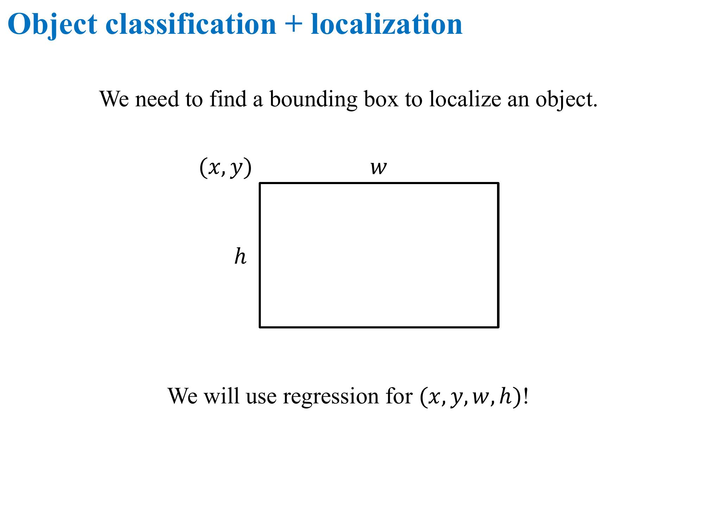


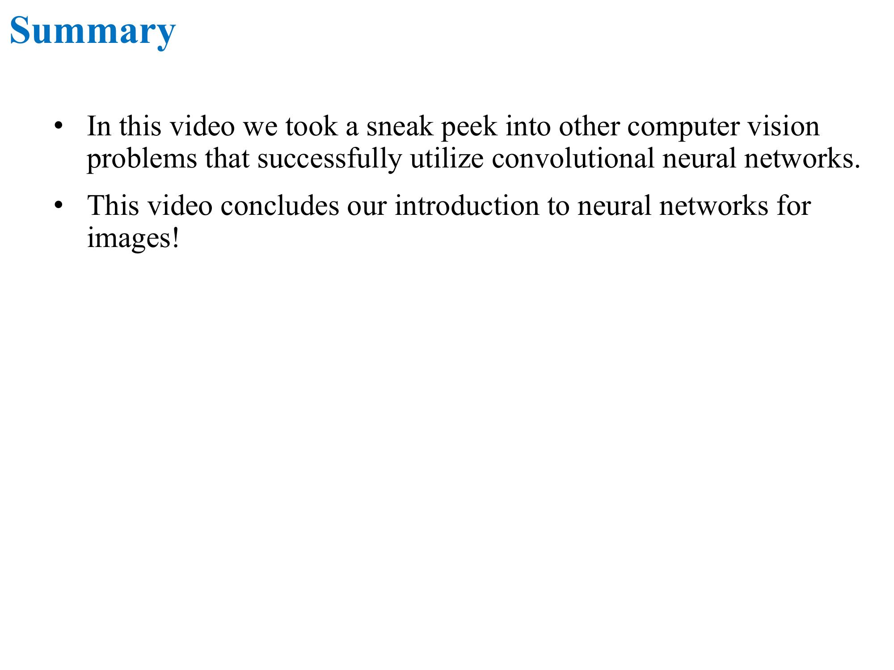
